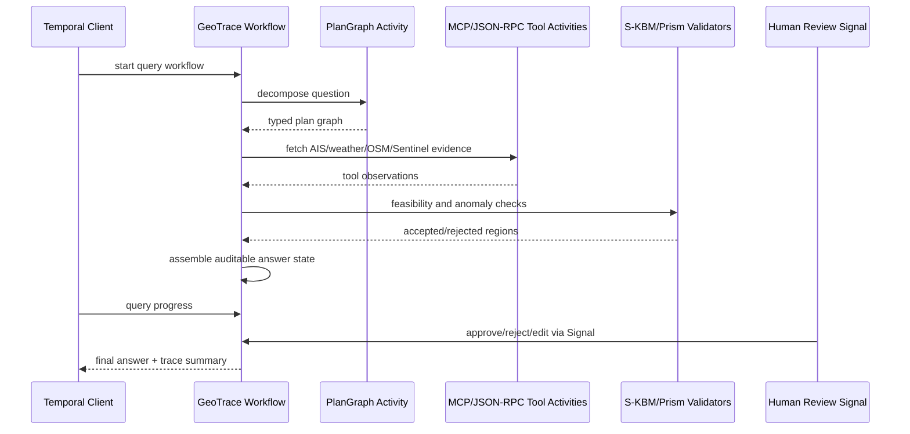

# GeoTrace-Agent Temporal: Durable Multi-Agent Spatiotemporal Reasoning

GeoTrace-Agent is the agentic-AI side of my spatiotemporal reasoning research. The original system was designed for auditable natural-language reasoning over heterogeneous geospatial sources: AIS vessel feeds, OSM road networks, Copernicus weather, Sentinel imagery, and physics-based space-time-prism tools.

This project shows how I would make that system durable with Temporal's TypeScript SDK and the Temporal AI SDK integration path. The runnable code is a compact policy-review Workflow, but the design maps directly to GeoTrace-Agent: deterministic planning in Workflows, non-deterministic tool/API/model calls in Activities, human-in-the-loop review with Signals, progress visibility through Queries, and MCP-ready tools for geospatial data access.

## Research motivation

Spatiotemporal agents are not just chatbots. A credible answer may require:

- decomposing a natural-language question into typed spatial sub-tasks;
- calling AIS, weather, road-network, imagery, and prism-reasoning tools;
- checking kinematic feasibility before presenting an answer;
- deduplicating tool calls and caching repeated semantic requests;
- tracing every step for auditability;
- routing uncertain outputs to a human reviewer;
- resuming after a model call, external API, or worker process fails.

Temporal is useful because those steps are long-running, externally connected, and stateful. The agent should not lose its plan, partial tool results, or review state because one API timed out or a Worker restarted.

## Original GeoTrace-Agent design

The full system uses a typed **PlanGraph** planner to decompose spatial questions into deterministic sub-tasks. Specialized agents handle:

- Hagerstrand space-time-prism reasoning;
- STAGD-DRM abnormal trajectory-gap detection;
- TGARD / DC-TGARD possible-rendezvous discovery;
- S-KBM kinematic validation;
- Sentinel/Copernicus evidence gathering;
- OSM road-network and AIS trajectory retrieval.

The engineering layer includes:

- MCP and JSON-RPC A2A tool protocols;
- OpenTelemetry tracing;
- Postgres human-in-the-loop review queues;
- semantic caching and tool-call deduplication;
- adaptive prompt compression;
- physical-feasibility rejection before user-facing output.

In the original project framing, caching and deduplication reduced token spend by roughly 40% and lowered per-query cost from about `$0.054` to `$0.034` versus no-cache ablations.

## Temporal architecture



## Temporal concepts used

- **Workflow Definition / Workflow Execution**: the Workflow owns the durable plan state and review lifecycle.
- **Activities**: tool calls, model calls, database writes, external APIs, and notifications run outside deterministic Workflow code.
- **Worker / Task Queue**: Workers poll a Task Queue for agent orchestration and tool execution.
- **Signals**: human approval, rejection, edits, threshold changes, and stop requests are modeled as outside events.
- **Queries**: reviewers can inspect progress, current stage, candidate answer, and score without mutating state.
- **Retry policies and timeouts**: flaky tool calls and model calls can be retried or bounded.
- **Event History / Replay**: the agent can recover its previous state after a crash without reissuing completed calls.
- **AI SDK integration path**: Vercel AI SDK calls can be used from Workflow code through `@temporalio/ai-sdk`, which wraps LLM calls as Activities behind the scenes.
- **MCP integration path**: MCP tool discovery and calls can be routed through Temporal's AI SDK integration so tool listing/calls get retries, timeouts, and observability.

## Mapping the runnable slice to GeoTrace-Agent

| Runnable code | GeoTrace-Agent production meaning |
| --- | --- |
| `reviewPolicyWorkflow` | one durable geospatial query/review Workflow |
| `scorePolicy` Activity | kinematic feasibility / confidence scoring |
| `draftReview` Activity | LLM answer drafting or evidence summarization |
| `persistReview` Activity | Postgres review queue / trace persistence |
| `notifyReviewer` Activity | HITL notification or Slack/email queue |
| `approveSignal` | human approval/edit/rejection event |
| `updateThresholdSignal` | runtime reviewer or policy threshold update |
| `progressQuery` | reviewer dashboard state |

## How this would use the AI SDK in production

The checked-in demo keeps Activities mocked so it runs without credentials. In the production version:

1. The Worker would install `@temporalio/ai-sdk` and configure `AiSdkPlugin`.
2. The Workflow would call Vercel AI SDK methods using `temporalProvider.languageModel(...)`.
3. Any model call would be wrapped into Activities by the plugin, preserving Durable Execution.
4. GeoTrace tools would be exposed through MCP servers and accessed with `TemporalMCPClient`.
5. Tool calls such as `fetchAIS`, `queryOSM`, `getCopernicusWeather`, `validatePrism`, and `scoreSKBM` would execute as Activities with retry policies and timeouts.

That design keeps the developer experience close to ordinary AI SDK code while giving the agent restart safety, observability, and durable state.

## Run locally

```bash
npm install
npx temporal server start-dev
npm run worker
npm run start
```

The Activities are deterministic mocks. They are placeholders for actual GeoTrace tool calls, review persistence, notification dispatch, and model-generated review drafts.

## Files

- `src/workflows.ts` - durable Workflow, Signals, Query, and Activity orchestration.
- `src/activities.ts` - mocked non-deterministic work that would become tool/model/database calls.
- `src/client.ts` - starts a Workflow and sends a human approval Signal.
- `src/worker.ts` - Worker configuration and Task Queue polling.
- `src/types.ts` - typed Workflow inputs, progress state, and review decisions.

## Suggested production expansion

1. Replace `draftReview` with an AI SDK model call through `@temporalio/ai-sdk`.
2. Add MCP clients for AIS, OSM, Copernicus, Sentinel, and prism validators.
3. Store trace summaries and review state in Postgres from Activities.
4. Add Search Attributes such as `query_id`, `vessel_id`, `region`, `risk_level`, and `review_status`.
5. Use Child Workflows for independent evidence-gathering branches when a query fans out across many tools.
6. Use Schedules for periodic monitoring queries, such as recurring dark-shipping or rendezvous scans.
7. Add Data Converter/Payload Codec support if trajectory evidence or review payloads need encryption/compression.

## Why this is intentionally small

The public code is a compact, runnable skeleton that exposes the orchestration pattern without publishing private datasets, full prompt chains, or large research infrastructure. The README documents how the Temporal pieces fit the full GeoTrace-Agent design.
