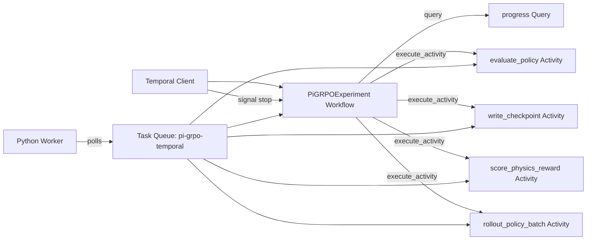

# Pi-GRPO Temporal: Durable Physics-Informed RL for Trajectory Policies

Pi-GRPO is the reinforcement-learning and alignment side of my trajectory-reasoning research. The original system was designed to train trajectory generation and trajectory-reasoning policies under physical constraints: a policy should not learn to "win" a reward function by producing motion that violates kinematics, sharp-turn limits, or known feasibility envelopes.

This project shows how I would structure that stack with Temporal's Python SDK. The runnable code uses a compact gridworld/Q-learning slice so it can run locally, but the README documents the full Pi-GRPO architecture: PPO, DPO, and GRPO sharing a physics-aware reward model; durable rollout batches; checkpointed policy state; and human-reviewed preference data flowing back from GeoTrace-Agent.

## Research motivation

Long-running RL experiments fail in boring but expensive ways:

- rollout workers crash after producing partial trajectories;
- reward jobs timeout or run with stale model checkpoints;
- preference datasets are revised after human review;
- online rollouts call external simulators or model-serving endpoints;
- policy candidates must be compared under reproducible evaluation settings;
- training should be stoppable, queryable, and restartable without corrupting experiment state.

Temporal gives this stack a durable spine. The Workflow records the orchestration decisions. Activities do the external work: rollout execution, S-KBM validation, Pi-DPM likelihood scoring, checkpoint writes, W&B/OpenTelemetry logging, and preference-data materialization.

## Original Pi-GRPO design

The full project unifies three policy-optimization paths:

- **GRPO** with group-baseline advantages and no value head.
- **DPO** with a physics-aware `gamma_phys` augmentation for preference optimization.
- **PPO** with bounded adaptive KL control for stable online updates.

The shared reward combines:

- an unbounded hard S-KBM violation penalty;
- a 95th-percentile jerk/curvature soft envelope;
- a Pi-DPM reconstruction-likelihood term;
- an optional cross-encoder preference model;
- human preference labels curated from GeoTrace-Agent reviews.

In the original research framing, the system trained on roughly 11K preference triples and reduced hard-violation rate from 18% under vanilla DPO to 0% with physics-augmented DPO while maintaining bounded KL behavior across 3,000 PPO steps.

## Temporal architecture



## Temporal concepts used

- **Workflow Definition / Workflow Execution**: `DurableRLExperiment` coordinates training batches, early stopping, final evaluation, and stop requests.
- **Activities**: `train_batch` and `evaluate_policy` stand in for rollout, reward, validation, checkpointing, and evaluation jobs.
- **Task Queue**: Workers poll `pi-grpo-temporal` in the runnable slice; a production version would use separate queues such as `rollouts`, `physics-scoring`, and `checkpoint-writes`.
- **RetryPolicy**: transient batch failures are retried without duplicating Workflow state.
- **Start-to-Close Timeout**: each Activity has a bounded execution window.
- **Heartbeat Timeout**: long-running rollout Activities heartbeat episode/step progress so a stalled Worker can be detected.
- **Signals**: the `stop` Signal lets an operator terminate training cooperatively.
- **Queries**: the `progress` Query exposes batch metrics without mutating Workflow state.
- **Event History / Replay**: completed Activity results are recorded so Workflow replay does not rerun rollout work.
- **Idempotent checkpoint-shaped outputs**: Activity outputs include deterministic checkpoint keys, which is the pattern I would use for content-addressed policy artifacts.

## Mapping the runnable slice to Pi-GRPO

| Runnable code | Pi-GRPO production meaning |
| --- | --- |
| `train_batch` | rollout + policy update Activity |
| Q-table update | PPO/DPO/GRPO update step |
| `reward_for` | hybrid physics reward |
| `evaluate_policy` | kinematic and preference-model evaluation |
| `checkpoint_key` | content-addressed model checkpoint URI |
| `progress` Query | experiment dashboard / W&B run status |
| `stop` Signal | operator stop / failed-ablation cutoff |

## Suggested production expansion

1. Split `train_batch` into separate Activities for rollout generation, physics scoring, preference scoring, and checkpoint writes.
2. Put vLLM/SGLang model-serving calls inside Activities, not Workflow code.
3. Add Search Attributes such as `experiment_id`, `policy_family`, `dataset_version`, and `reward_version` for Temporal Web visibility.
4. Use Continue-As-New for very long training jobs to keep Event History bounded.
5. Add Child Workflows for per-policy ablations, so PPO, DPO, and GRPO runs can be compared while retaining isolated histories.
6. Add a Data Converter/Payload Codec if checkpoint metadata or preference records need encryption or compression.

## Run locally

```bash
python -m venv .venv
source .venv/bin/activate
pip install temporalio

temporal server start-dev
python app.py worker
python app.py start
```

The demo assumes a local Temporal dev server at `localhost:7233`. To use Temporal Cloud, update `connect_client()` with the Cloud endpoint, namespace, and TLS/API-key configuration.

## Files

- `app.py` - runnable Python Temporal Workflow, Activities, Worker, and Client.

## Why this is intentionally small

The purpose is not to reproduce the full training infrastructure in a public repo. The purpose is to show the durable orchestration shape behind Pi-GRPO in code that can be read quickly: deterministic Workflow state, retryable Activities, queryable progress, cooperative cancellation, and checkpoint-aware batch outputs.
